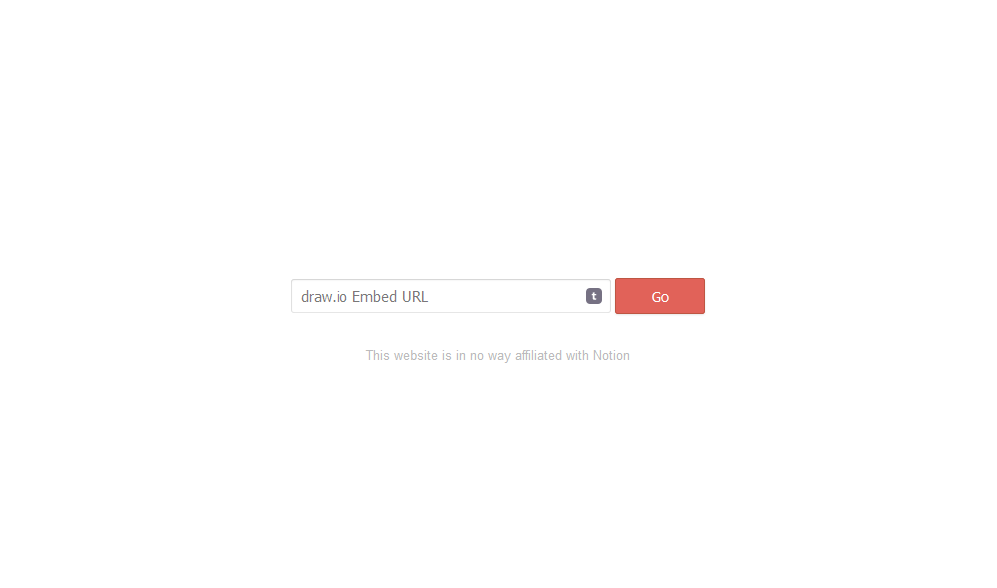
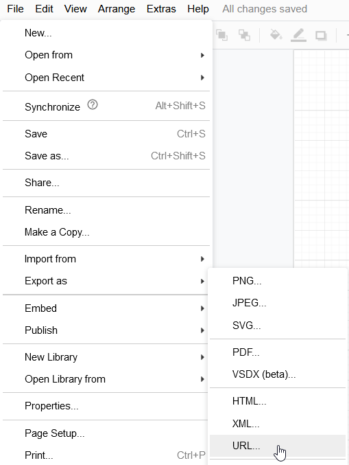
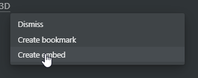
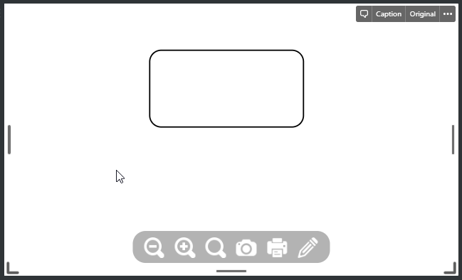

<!--
*** Thanks for checking out this README Template. If you have a suggestion that would
*** make this better, please fork the repo and create a pull request or simply open
*** an issue with the tag "enhancement".
*** Thanks again! Now go create something AMAZING! :D
-->

<!-- PROJECT LOGO -->
 

  

  <h3 align="center">draw.io Notion Embed</h3>

  

    A super simple project that lets you embed draw.io diagrams directly into Notion.
     
     
    <a href="https://drawio-notion-embed.netlify.app/">View Demo</a>
    ·
    <a href="https://github.com/ivankahl/drawio-notion-embed/issues">Report Bug</a>
    ·
    <a href="https://github.com/ivankahl/drawio-notion-embed/issues">Request Feature</a>
  

<!-- TABLE OF CONTENTS -->

## Table of Contents

- [About the Project](#about-the-project)
  - [Built With](#built-with)
- [Getting Started](#getting-started)
  - [Prerequisites](#prerequisites)
  - [Installation](#installation)
- [Usage](#usage)
- [Roadmap](#roadmap)
- [Contributing](#contributing)
- [License](#license)
- [Contact](#contact)
- [Acknowledgements](#acknowledgements)

<!-- ABOUT THE PROJECT -->

## About The Project

Embedding draw.io diagrams inside Notion is a bit of pain because it doesn't work. If you have tried to embed a diagram in Notion, you will notice that it breaks. This is quite frustrating when you are doing project planning or writing technical documentation in Notion and wish to link to your diagrams in Notion.

This very very simple HTML page fixes this. It allows you to specify your draw.io Embed URL and then it will render it in a fullscreen, responsive iFrame that can be embedded into Notion and look good!

### Built With

We don't need no heavy JS framework (not hating on them though). However, this project has been built with the purest forms of web technologies:

- HTML: uhm... Inspect Element to learn more?
- CSS: again... Inspect Element...
- [Vanilla JS](http://vanilla-js.com/)

<!-- GETTING STARTED -->

## Getting Started

You can either use the already deployed version on Netlify ([https://drawio-notion-embed.netlify.app/](https://drawio-notion-embed.netlify.app/)) or if you really want to you can deploy it yourself. It's a single HTML file so just drop it on any public web server and you should be good to go.

If you want to deploy to Netlify, you can simply click the button below:

## Usage

1. In draw.io, go to **File -> Export as -> URL...**
   
2. Copy the URL that is displayed.
3. Navigate to [https://drawio-notion-embed.netlify.app/](https://drawio-notion-embed.netlify.app/) (or your own URL)
4. Paste the URL that you copied from draw.io into the text box and click **Go**
5. A link will be displayed below that you can copy
6. In Notion, paste the link and in the popup, click _Create embed_
   
7. You should see the diagram embedded in Notion now
   

<!-- CONTRIBUTING -->

## Contributing

If you have any contributions you would like to make it would be **greatly appreciated**.

1. Fork the Project
2. Create your Feature Branch (`git checkout -b feature/AmazingFeature`)
3. Commit your Changes (`git commit -m 'Add some AmazingFeature'`)
4. Push to the Branch (`git push origin feature/AmazingFeature`)
5. Open a Pull Request

<!-- LICENSE -->

## License

Distributed under the MIT License. See `LICENSE.txt` for more information.

<!-- CONTACT -->

## Contact

Ivan Kahl - hello@ivankahl.com

Project Link: [https://github.com/ivankahl/drawio-notion-embed](https://github.com/ivankahl/drawio-notion-embed)
